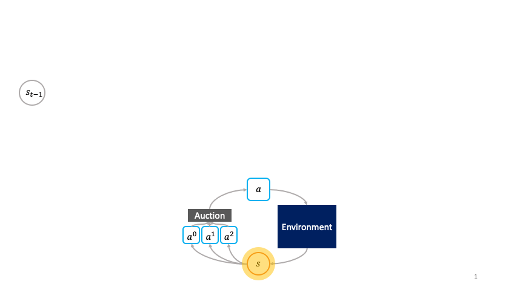

# Decentralized-RL
[](https://github.com/mbchang/decentralized-rl/blob/master/LICENSE)

This is the code complementing the paper [Decentralized Reinforcment Learning: Global Decision-Making via Local Economic Transactions](https://arxiv.org/abs/2007.02382) by 
[Michael Chang](http://mbchang.github.io/),
[Sid Kaushik](https://github.com/sidk99),
[Matt Weinberg](https://www.cs.princeton.edu/~smattw/),
[Tom Griffiths](http://cocosci.princeton.edu/tom/tom.php),
and [Sergey Levine](http://people.eecs.berkeley.edu/~svlevine/), accepted to the International Conference on Machine Learning, 2020.

Check out the accompanying [blog post](https://bair.berkeley.edu/blog/2020/07/11/auction/).



## Setup
Set the PYTHONPATH: `export PYTHONPATH=$PWD`.

Create a conda environment with python version 3.6.

Install dependencies: `pip install -r requirements.txt`. This should also install `babyai==0.1.0` from `https://github.com/sidk99/babyai.git` and `gym-minigrid==1.0.1`.

For the TwoRooms environment, comment out 
```
if self.step_count >= self.max_steps:
    done = True
```
in `gym_minigrid/minigrid.py` in your gym-minigrid installation. By handling time-outs on the algorithm side rather than the environment side, we can treat the environment as an infinite-horizon problem. Otherwise, we'd have to put the time-step into the state to preserve the Markov property.

For GPU, set OMP_NUM_THREADS to 1: `export OMP_NUM_THREADS=1`.

## Training
Run `python runner.py --<experiment-name>` to print out example commands for the environments in the paper. Add the `--for-real` flag to run those commands. You can enable parallel data collection with the `--parallel_collect` flag. You can also specify the gpu ids. As examples, in `runner.py`, the methods that launch `bandit`, `chain`, and `duality` do not use gpu while the others use gpu 0.

For the TwoRooms environment, you would need to pre-train the subpolicies first. Then you would need to specify the expriment folders for training the society using the pre-trained primitives. Instructions are in `run_tworooms_pretrain_task` and `run_tworooms_transfer_task` of `runner.py`.

## Visualization
You can view the training curves in `<exp_folder>/<seed_folder>/group_0/<env-name>_train/quantitative` and you can view visualizations (for environments that have image observations) in `<exp_folder>/<seed_folder>/group_0/<env-name>_test/qualitative`.

## Credits
The PPO update is based on [this repo](https://github.com/Khrylx/PyTorch-RL.git).
